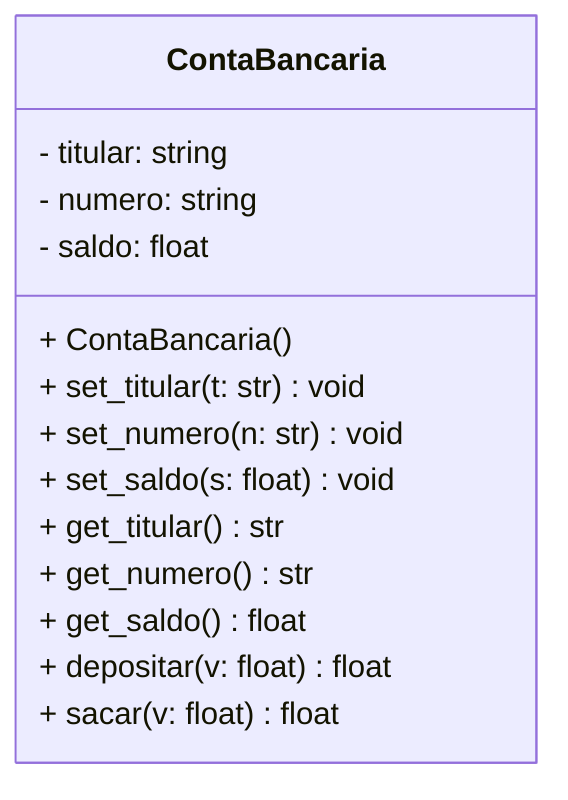

# 3. Uma Conta Bancaria

```mermaid
classDiagram
    class ContaBancaria {
        - titular: string
        - numero: string
        - saldo: float
        + ContaBancaria()
        + set_titular(t: str) void
        + set_numero(n: str) void
        + set_saldo(s: float) void
        + get_titular() str
        + get_numero() str
        + get_saldo() float
        + depositar(v: float) float
        + sacar(v: float) float
    }
```
