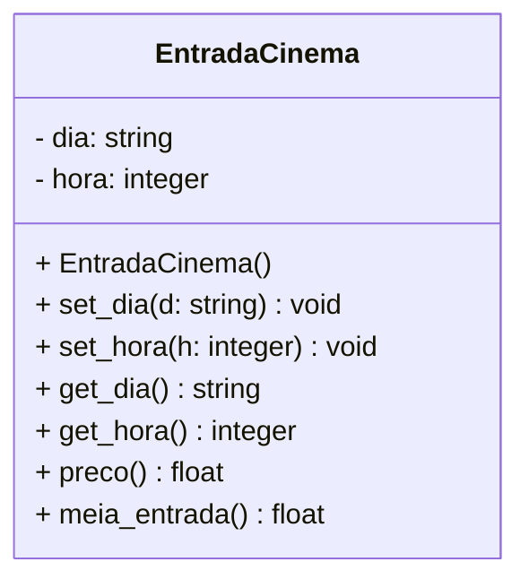

# 4. Uma Entrada de Cinema

```mermaid
classDiagram
    class EntradaCinema {
        - dia: string
        - hora: integer
        + EntradaCinema()
        + set_dia(d: string) void
        + set_hora(h: integer) void
        + get_dia() string
        + get_hora() integer
        + preco() float
        + meia_entrada() float
    }
```
