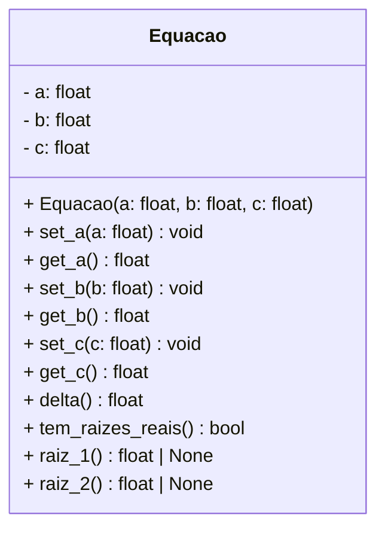

# 4. Uma Equação do Segundo Grau

```mermaid
classDiagram
  class Equacao {
    - a: float
    - b: float
    - c: float
    + Equacao(a: float, b: float, c: float)
    + set_a(a: float) void
    + get_a() float
    + set_b(b: float) void
    + get_b() float
    + set_c(c: float) void
    + get_c() float
    + delta() float
    + tem_raizes_reais() bool
    + raiz_1() float | None
    + raiz_2() float | None
  }
```