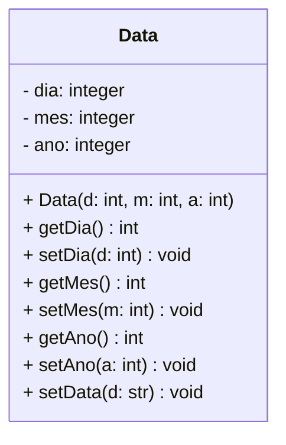

# 5. Uma Data

```mermaid
classDiagram
    class Data {
        - dia: integer
        - mes: integer
        - ano: integer
        + Data(d: int, m: int, a: int)
        + getDia() int
        + setDia(d: int) void
        + getMes() int
        + setMes(m: int) void
        + getAno() int
        + setAno(a: int) void
        + setData(d: str) void
    }
```
